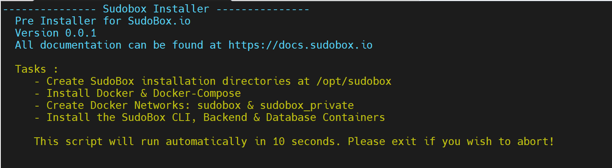

# SudoBox Installer

### Minimum Specs and Requirements
<ol>
<li>Stable: Ubuntu 18/20/21</li>
<li>CPU 2 Cores or 2 VCores</li>
<li>4GB Ram</li>
<li>20GB Disk Space</li>
<li>A VPS/VM or Dedicated Server</li>
<li>An existing domain or buy a new one from namecheap</li>
<li>Cloudflare account free tier <a href=https://www.cloudflare.com/en-gb/plans/free/>SignUp</a></li>
</ol>

### PRE-INSTALLATION 
To begin your journey with Sudobox.io and execute the installation process you can type or paste the command below:

``` curl -fsSl https://raw.githubusercontent.com/sudobox-io/sb-install/master/install.sh | sudo bash && source ~/.bashrc && sb ```

have the following information handy to speed up your installation: 

<ol>
<li>Cloudflare Email</li>
<li>Cloudflare API Token --> learn to make one here. <a href=https://developers.cloudflare.com/api/tokens/create//>API Tokens</a></li>
<li>Cloudflare Global API --> Find it here. <a href=https://developers.cloudflare.com/api/keys/#view-your-api-key/>Global API</a></li>
</ol>



### NOTICE 
Sudobox is underway with features to be added on a weekly basis therefore all documentation, container images and code are subject to change. 

### Support 
Looking for more information please visit our docs <a href="https://docs.sudobox.io">https://docs.sudobox.io</a>

If you are looking for help our discord and Forum members are ready to lend a Hand..  <a href="https://sudobox.io">Sudobox</a>
